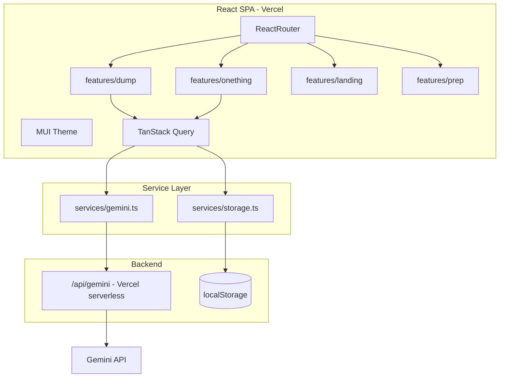

# Axel Prototype Build Plan

## Current state

The repo is **docs-only**. [`docs/PROJECT_OVERVIEW.md`](docs/PROJECT_OVERVIEW.md) defines product vision; [`docs/INITIAL_ARCHITECTURE.md`](docs/INITIAL_ARCHITECTURE.md) describes the long-term three-layer product.

| Topic | Prototype approach |
|-------|-------------------|
| Data | **Local-first** (localStorage) — Supabase deferred to post-prototype |
| AI | Gemini API (swappable via service layer) |

This aligns with [`INITIAL_ARCHITECTURE.md`](docs/INITIAL_ARCHITECTURE.md) local-first stance. Supabase sync remains a future phase when auth and POPIA consent flows are ready.

**Action:** Add [`docs/PROTOTYPE_ARCHITECTURE.md`](docs/PROTOTYPE_ARCHITECTURE.md) capturing the prototype stack so docs stay aligned.

---

## Architecture



**Why a Vercel serverless proxy for Gemini:** A Vite SPA cannot safely hold a Gemini key. Even `.env` values prefixed with `VITE_` ship to the browser. A single [`api/gemini.ts`](api/gemini.ts) route keeps the key server-side while [`services/gemini.ts`](src/services/gemini.ts) stays the one swap point for Claude later.

**Why local-first for now:** Faster setup, no backend dependency, matches long-term architecture doc. Data stays on-device. Trade-off: data is tied to one browser on one device until Supabase sync is added.

---

## Target folder structure

```
axel/
  api/
    gemini.ts                 # Vercel serverless — Gemini calls only here
  src/
    features/
      dump/                     # Noise dump input screen
      onething/                 # Axel response + check-in
      landing/                  # Grounding tools (static content first)
      prep/                     # Preparation tool (journal summary stub)
    services/
      gemini.ts                 # fetch('/api/gemini') — swap point for Claude
      storage.ts                # All local reads/writes — swap point for Supabase
    types/
      storage.ts                # Dump, Response, Checkin, PrepNote types
    theme/
      index.ts                  # MUI theme — Axel visual identity
    components/
      shared/                   # Button, TextArea, ScreenShell, CrisisBanner
    app/
      App.tsx
      router.tsx
      providers.tsx             # ThemeProvider, QueryClientProvider
    constants/
      user.ts                   # PROTOTYPE_USER_ID = 'prototype-user-001'
  docs/
    PROTOTYPE_ARCHITECTURE.md   # New — prototype stack doc
  .env.example
  vercel.json                   # If needed for API routing
```

TypeScript throughout (`.ts` / `.tsx`).

---

## Day 1 — Project setup and deploy

### 1. Scaffold Vite + React + TypeScript

```bash
npm create vite@latest . -- --template react-ts
```

Install dependencies:

- `@mui/material@^6` + `@emotion/react` + `@emotion/styled`
- `@fontsource/inter` (or `@fontsource/plus-jakarta-sans`)
- `react-router-dom`
- `@tanstack/react-query`

No Supabase client for now.

### 2. MUI theme ([`src/theme/index.ts`](src/theme/index.ts))

Define before any feature UI:

- **Palette:** slate/warm grey background (`#1e293b` range), muted sage or deep teal accent (`#5b8a8a` or similar), off-white text
- **Typography:** Inter or Plus Jakarta Sans, 16px base, line-height 1.6+
- **Shape:** `borderRadius: 12` globally
- **Spacing:** default 8px unit; components use generous padding (`p: 3`, `gap: 3`)
- **Shadows:** minimal — override MUI elevation to flat or near-flat
- **Components:** soften `Button`, `TextField`, `Paper` defaults in theme overrides

Wrap app in `ThemeProvider` + `CssBaseline` in [`src/app/providers.tsx`](src/app/providers.tsx).

### 3. Local storage service ([`src/services/storage.ts`](src/services/storage.ts))

Use **localStorage** with a single JSON store key (`axel-data`). Mirror the Supabase schema so migration later is a straight swap in this one file:

```typescript
// src/types/storage.ts
type Dump = { id: string; user_id: string; content: string; created_at: string }
type Response = { id: string; dump_id: string; user_id: string; content: string; created_at: string }
type Checkin = { id: string; response_id: string; user_id: string; answer: 'yes' | 'not_yet' | 'not_sure'; created_at: string }
type PrepNote = { id: string; user_id: string; content: Record<string, string>; created_at: string }
```

[`src/services/storage.ts`](src/services/storage.ts) exports:

- `createDump(content)`
- `createResponse(dumpId, content)`
- `createCheckin(responseId, answer)`
- `getDump(id)` / `getResponseByDumpId(dumpId)`
- `getRecentDumps()`
- `savePrepNote(content)` / `getPrepNotes()`

All functions inject `user_id` from [`src/constants/user.ts`](src/constants/user.ts). IDs via `crypto.randomUUID()`. Timestamps as ISO strings.

When Supabase arrives later, rewrite `storage.ts` internals only — features stay unchanged.

### 4. Environment variables

[`.env.example`](.env.example):

```
GEMINI_API_KEY=          # Server-side only — no VITE_ prefix
```

Local: `.env` gitignored. Vercel: same var in project settings.

### 5. App shell

- [`src/app/router.tsx`](src/app/router.tsx): routes `/`, `/response/:dumpId`, `/landing`, `/prep`
- [`src/components/shared/CrisisBanner.tsx`](src/components/shared/CrisisBanner.tsx): persistent SADAG link (0800 21 22 23) per [`INITIAL_ARCHITECTURE.md`](docs/INITIAL_ARCHITECTURE.md) safeguard
- Minimal bottom nav or calm header nav between the four screens
- Deploy empty shell to Vercel connected to GitHub repo

**Day 1 done when:** themed empty app loads on Vercel, local storage round-trip test passes (write + read one dump).

---

## Day 2 — Axel prompt (before wiring UI)

Work in **Google AI Studio** first, not in code.

### Prompt goals

Input: raw overwhelm dump (messy, emotional, multi-topic).
Output: JSON or structured text with:
1. Brief acknowledgment (calm, non-clinical, no shame)
2. **One** next step (actionable, small, specific)
3. Optional one-line reframe (grounded, not motivational fluff)

### Prompt constraints (non-negotiable from product docs)

- Never diagnose or use clinical labels on the user
- Never return a to-do list — exactly one thing
- Plain language, short sentences
- If input suggests crisis/distress, include gentle redirect to human support (SADAG)

### Test matrix (AI Studio)

Run 10+ real overwhelm scenarios. Pass criteria: 8/10 outputs feel like relief, not another task list. Only then copy final prompt into [`api/gemini.ts`](api/gemini.ts) as a system prompt constant.

---

## Days 3–5 — Four feature screens

Build in flow order so each screen can be tested end-to-end.

### Feature 1: Dump ([`src/features/dump/`](src/features/dump/))

- Full-screen calm textarea (MUI `TextField` multiline, generous min-height)
- Placeholder copy aligned with product voice: "Pour it all here. Everything that's loud."
- Submit calls TanStack Query mutation:
  1. `createDump(content)` via storage service
  2. `generateOneThing(content)` via Gemini service
  3. `createResponse(dumpId, aiContent)` via storage service
  4. Navigate to `/response/:dumpId`
- Loading state: calm spinner + "Axel is listening..." (no frantic animation)
- Error state: plain retry message, no guilt language

### Feature 2: One Thing + Check-in ([`src/features/onething/`](src/features/onething/))

- Fetch response by `dumpId` from local storage
- Display the one thing prominently (large type, breathing room)
- Below: "Did that help you move?" with three low-friction options (Yes / Not yet / Not sure)
- Save to checkins via storage service; no streaks, no follow-up nag
- Secondary action: "Dump again" back to `/`

### Feature 3: Landing tools ([`src/features/landing/`](src/features/landing/))

Start with **static, curated content** (no AI needed for prototype):

- 3–4 grounding exercises: box breathing, 5-4-3-2-1 sensory, body scan snippet, cold-water reset
- Each as expandable card — short instructions, interruptible
- MUI `Accordion` or simple step cards
- Calm copy, no timers that pressure the user

### Feature 4: Prep tool ([`src/features/prep/`](src/features/prep/))

Prototype scope (journal is phase 3):

- Guided prompts as static form fields (e.g. "When did you first notice these patterns?", "What contexts are hardest?")
- Save answers via `savePrepNote()` to local storage
- "Export summary" button: formats entries into plain text the user can copy for an appointment
- Prominent disclaimer: "This does not diagnose. It helps you prepare."

---

## Day 6 — Real user test

- One person, one genuine overwhelm moment
- Observe: time to first keystroke, do they trust the one thing, do they feel worse after?
- Test on **one device/browser** (local-first limitation — data won't sync to a second device yet)
- Verify data persists after browser refresh on same device

---

## Day 7 — Fix pass

Prioritize from observation, likely candidates:

- Prompt tuning (most common fix)
- Loading/error UX
- Text size and contrast on mobile
- Navigation clarity between dump and landing tools

---

## Shared components to build early

| Component | Purpose |
|-----------|---------|
| `ScreenShell` | Consistent padding, max-width, crisis banner slot |
| `CalmButton` | Themed primary/secondary actions |
| `CalmTextArea` | Dump input styling |
| `LoadingState` | Shared spinner + message |
| `Disclaimer` | Reusable non-diagnosis framing |

---

## Git and deployment

1. Init git repo, connect to `https://github.com/CarlienRust/axel`
2. Add `.gitignore` (include `.env`, `node_modules`, `dist`)
3. Push to `main`; Vercel auto-deploys on push
4. Verify `/api/gemini` works in production (not just localhost)

---

## Out of scope for this prototype (explicit deferrals)

- **Supabase / cloud sync** (deferred — swap in via `services/storage.ts` later)
- Authentication (hardcoded `prototype-user-001` in local records)
- Journal feature (phase 3)
- Psychoeducation library / reframe content library
- Afrikaans/i18n
- PWA offline mode
- POPIA consent flows (consent UI before any cloud sync)
- Subscription / monetization
- Voice input for dumps

---

## Risk notes

1. **Single-device data:** localStorage is browser-bound. User testing must happen on the device they'll actually use. Document this clearly; Supabase is the fix when ready.
2. **Gemini key exposure:** Must use Vercel serverless proxy, not client-side key.
3. **Storage limits:** localStorage caps at ~5MB. Fine for prototype; monitor if prep notes grow large.
4. **Prep tool scope:** Without journal history, prep is a standalone guided form — honest about that in UI copy.
